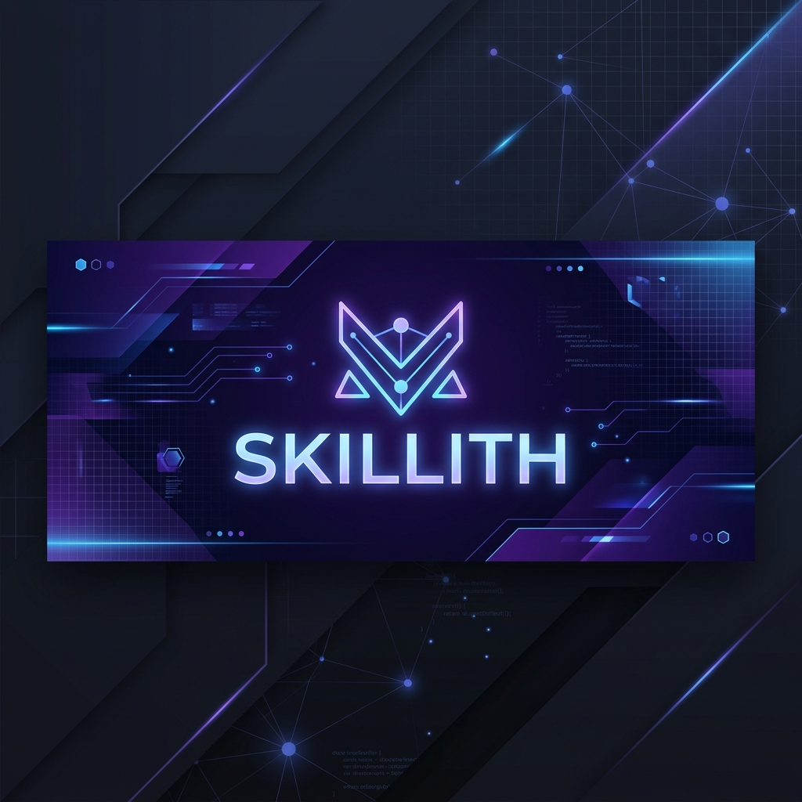

  
    
  
  # Hi there, I'm Sam Ebrahimi! 👋
  
  
  
  
  
  <h3>Technical Project Manager | AI-Powered Product Delivery | Cloud Migration</h3>
  
I bridge the gap between business vision and technical execution, leveraging agentic AI and cloud infrastructure to deliver high-quality, fully functional products.

## 🧑‍💻 About Me
I am an IT Project Manager and Technical Product Creator. I specialize in orchestrating large-scale digital transformations, migrating enterprise systems to the cloud, and building AI-augmented software solutions. I use advanced agentic AI environments to design, build, and deploy cross-platform mobile apps (**Flutter/Dart**), robust web platforms (**React/TypeScript**), and secure serverless backend APIs (**FastAPI/Firebase**).

---

## ⚡ GitHub Insights & Actual Codebase Distribution

  <table border="0">
    <tr>
      <td width="50%" align="center">
        
      </td>
      <td width="50%" align="center">
        
      </td>
    </tr>
  </table>

---

## 🛠️ Tech Stack & Expertise

<table>
  <tr>
    <td width="33.3%" valign="top">
      <h4>📱 Frontend & Mobile</h4>
      <ul>
        <li>Flutter / Dart</li>
        <li>React / TypeScript</li>
        <li>Vite / HTML5 / CSS3</li>
        <li>Progressive Web Apps (PWAs)</li>
      </ul>
    </td>
    <td width="33.3%" valign="top">
      <h4>⚙️ Backend & Cloud</h4>
      <ul>
        <li>FastAPI / Python / REST APIs</li>
        <li>Firebase Auth / Firestore</li>
        <li>GCP / Cloud Functions</li>
        <li>Isar Database (Encrypted)</li>
      </ul>
    </td>
    <td width="33.3%" valign="top">
      <h4>🧠 AI & Automation</h4>
      <ul>
        <li>Google Gemini API</li>
        <li>OpenAI API (Lore & Logic)</li>
        <li>Web Speech APIs</li>
        <li>Agentic SDLC Orchestration</li>
      </ul>
    </td>
  </tr>
</table>

---

## 🚀 Featured Projects
*Listed in order of codebase size (largest to smallest)*

### 🦖 TerraCatch (6.68 GB)
> Pokémon-style real-world animal capture & stats game utilizing AI video analysis.
- **Tech Stack:** `Flutter` `FastAPI (Python)` `OpenAI API (Lore Engine)` `Firebase Auth & Sync`
- **Status:** Live Prototype / Matchmaking Hub 🟡
- **Links:** 🌐 [Live Webapp](https://terracatch.online) | 🐙 [GitHub Repository](https://github.com/Skillith/Terracatch)

<b>🔍 Key Features & Architecture</b>

- Real-time animal video identification.
- Lore-driven AI stat profiles (7 base stats + movesets).
- Evolution tokens, collection synchronization, and exhibition battles simulator.

 

### 📱 Morn & Eve (55.08 MB)
> A daily spiritual companion app designed for Baha'i reading, daily cycles tracking, and service quest logging.
- **Tech Stack:** `Flutter` `Dart` `Isar Database (Encrypted)` `Firebase Auth & Firestore`
- **Status:** Active Development & Live on App Stores 🟡
- **Links:** 🤖 [Google Play Store](https://play.google.com/store/apps/details?id=com.skillith.morneve) | 🍎 [Apple App Store](https://apps.apple.com/app/morn-eve/id6503698064) | 🐙 [GitHub Repository](https://github.com/Skillith/Morn-Eve)

<b>🔍 Key Features & Architecture</b>

- Morning/Evening cycle progression, habits tracking, and streaks.
- Badi' calendar implementation (19 months, Intercalary days, Fast tracker).
- Offline-first encrypted database using Isar.
- Secure, progress-only cloud synchronization via Firebase.

 

### 🗺️ Wayfare Guide (8.74 MB)
> Road-trip narration companion that reads geographical and cultural facts about the landscape as you drive.
- **Tech Stack:** `Flutter` `Firebase` `Gemini API`
- **Status:** Prototype (Alpha Testing) 🟡
- **Links:** 🧪 [Closed Alpha Registration](https://github.com/Skillith/Wayfare-Guide) | 🐙 [GitHub Repository](https://github.com/Skillith/Wayfare-Guide)

<b>🔍 Key Features & Architecture</b>

- Real-time GPS coordinate listeners.
- Gemini API narrator with context-rich folklore/geographical insights.
- National Park adventure themed user interface.

 

### 🎙️ Dalil Notecard (2.10 MB)
> Hands-free tour guide assistant that transcribes speech in real-time and ticks off talking points automatically.
- **Tech Stack:** `React` `TypeScript` `Speech Recognition API` `Firebase Auth & Firestore` `Google Gen AI`
- **Status:** Deployed & Live 🟢
- **Links:** 🌐 [Live Webapp](https://skillith.github.io/DalilNotecard) | 🐙 [GitHub Repository](https://github.com/Skillith/DalilNotecard)

<b>🔍 Key Features & Architecture</b>

- Real-time speech-recognition API integration.
- Local keyword match engine for offline reliability.
- Adaptive API throttling (5-15 RPM) to prevent limit hits.
- Serverless Gemini API proxy enforcing premium usage limits.

 

### 🧭 Wayfare Logic (1.93 MB)
> Multi-modal conversational travel routing engine that connects flights, rail, and regional bus itineraries.
- **Tech Stack:** `React` `TypeScript` `Vite` `Firebase Cloud Functions` `Kiwi/Amadeus APIs`
- **Status:** Design & Live Webapp 🔵
- **Links:** 🌐 [Live Webapp](https://skillith.github.io/Wayfare-Logic) | 🐙 [GitHub Repository](https://github.com/Skillith/Wayfare-Logic)

<b>🔍 Key Features & Architecture</b>

- Interactive Gemini 3.5 Flash intake interview loop.
- Layover empathy hotel recommendation engine.
- Persistent session memory and direct-booking deep links model.

 

### 🧹 Mailbox Janitor (0.52 MB)
> Real-time AI Gmail cleaner agent that runs client-side to classify and clean out marketing clutter.
- **Tech Stack:** `React 19` `TypeScript` `Vite` `Gemini 2.5 Flash` `Gmail REST API`
- **Status:** Deployed & Production Ready 🟢
- **Links:** 🌐 [Live Webapp](https://skillith.github.io/Mailbox-Janitor) | 🐙 [GitHub Repository](https://github.com/Skillith/Mailbox-Janitor)

<b>🔍 Key Features & Architecture</b>

- Interactive log terminal emulator for background processing.
- BYOK (Bring Your Own Key) setup panel for user control.
- Free 24/7 headless Google Apps Script trigger integrations.
- Custom whitelisting and category-to-action rule mappings.

---

## 📬 Let's Connect!

Feel free to reach out, collaborate on projects, or check out my work!

